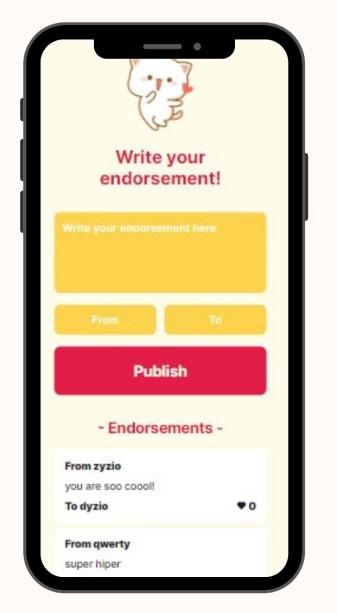
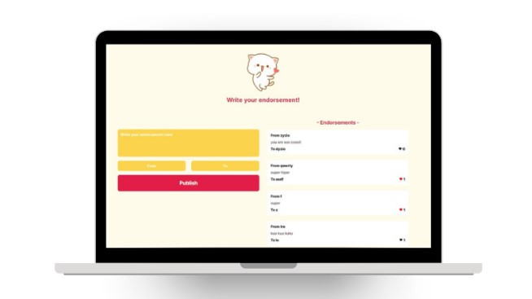

## Cat Endorsement App
#### Simple app built with Firebase
### Project live link
[Netlify Link](https://endorsement-app.netlify.app/)

### Project screenshots
 

### Project description

- write and publish your endorsement
- 'mobile' app design, favicons
- data saved to Firebase Realtime Database
- each user can like each endorsement only once - condition checked with localStorage data
- built with:  

